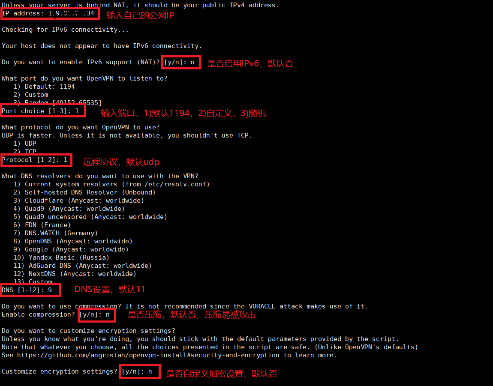
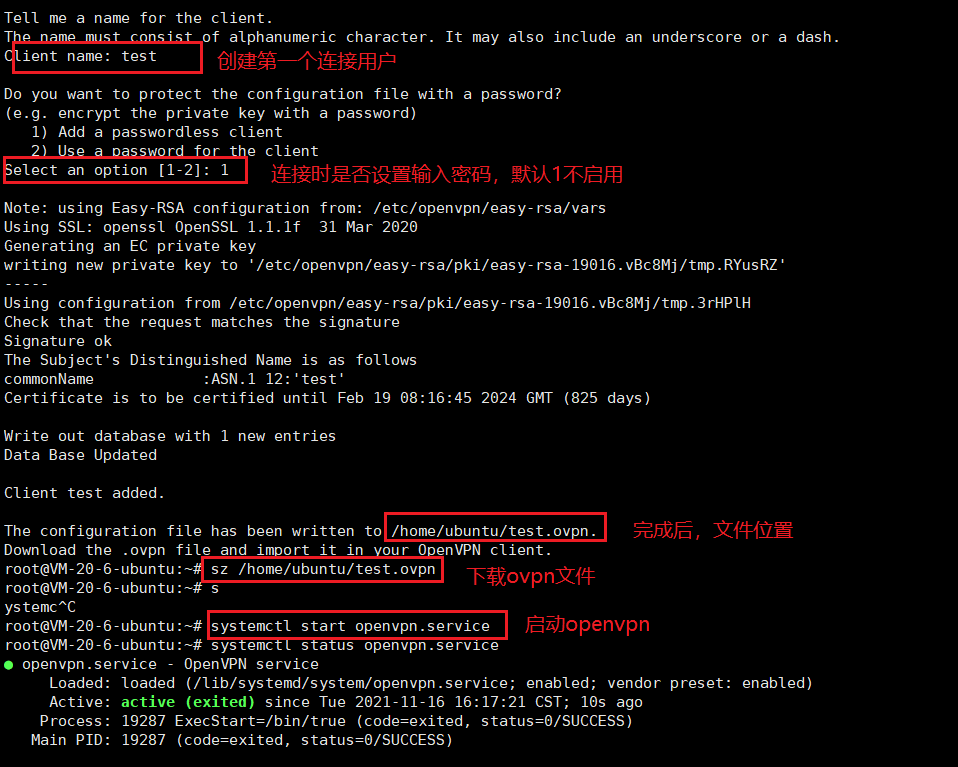
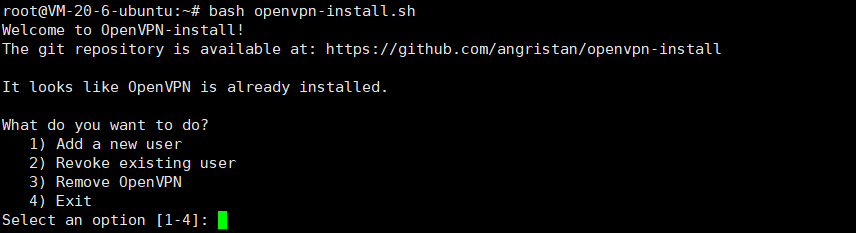
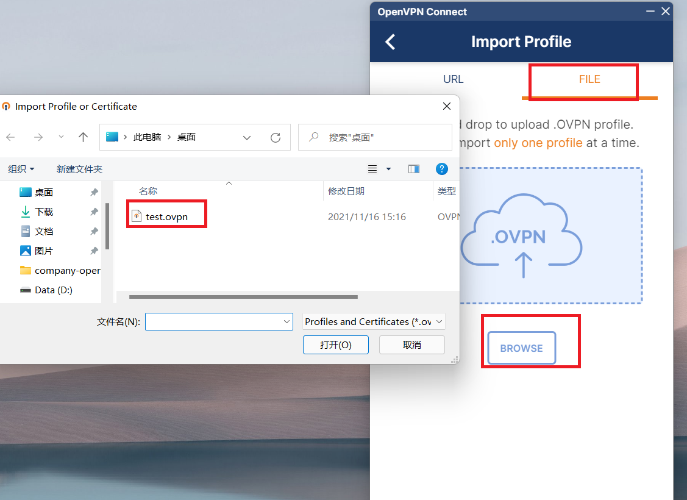
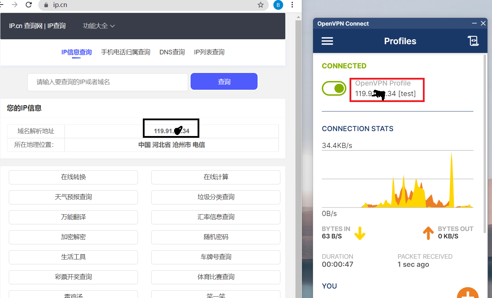

# 1：简介

采用脚本快速搭建访问公司内网，推荐两个脚本，github使用较多且正规的脚本，推荐第二个脚本，设置选项更多（如连接加密）。

github脚本下载地址1：
https://github.com/Nyr/openvpn-install

github脚本下载地址2：
https://github.com/angristan/openvpn-install

# 2：下载安装

下载脚本，一句命令即可安装，根据提示选择即可：

```
#下载
curl -O https://raw.githubusercontent.com/angristan/openvpn-install/master/openvpn-install.sh
#添加执行权限
chmod +x openvpn-install.sh
#执行脚本
./openvpn-install.sh
```

或者直接用git clone，获取整个包，然后进入文件夹执行脚本即可：

```
#下载
git clone git@github.com:angristan/openvpn-install.git
#执行脚本
bash openvpn-install/openvpn-install.sh
```


相关选项，自己选择即可




完成后，最后设置添加用户，添加完成后，请自行下载连接文件至电脑中。

我这里xshell直接用sz命令下载的，有些远程ssh工具不支持sz命令。

或者winSCP下载至自己电脑上。




安装完成，再次运行脚本，可以选择 1)添加用户 2)移除已存在的用户 3)协助软件 4)退出




# 3：客户端连接

官方客户端下载：
https://openvpn.net/vpn-client/

安装完成后，导入文件




开始连接，查看IP地址：



**注意的坑：** 根据自己服务器商，有些有默认的防火墙，需要自己添加1194端口，或者自己设置的端口。如腾讯云需要添加防火墙。否则连接失败。


